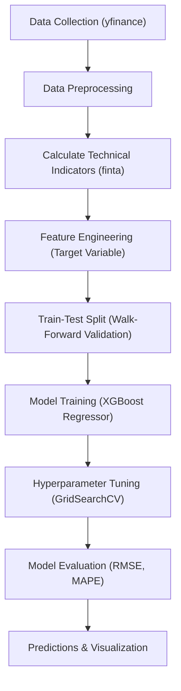

# Stock Price Prediction using XGBoost

A machine learning project that predicts Microsoft (MSFT) stock prices using XGBoost regression with technical indicators and walk-forward validation.

## 📋 Table of Contents
- [Project Overview](#project-overview)
- [Dataset](#dataset)
- [Technical Indicators](#technical-indicators)
- [Model Architecture](#model-architecture)
- [Installation](#installation)
- [Usage](#usage)
- [Results](#results)
- [Performance Metrics](#performance-metrics)
- [Project Structure](#project-structure)
- [Known Issues & Fixes](#known-issues--fixes)

---

## 🎯 Project Overview

This project implements a **time-series forecasting system** to predict the next day's closing price of Microsoft stock. The model uses:
- **Historical stock data** (2017-2021)
- **5 technical indicators** derived from OHLCV data
- **XGBoost Regressor** for predictive modeling
- **Walk-forward validation** for realistic performance evaluation

### Workflow Diagram



### Key Features:
✅ Automatic technical indicator calculation  
✅ Hyperparameter tuning using GridSearchCV  
✅ Walk-forward validation (time-series aware)  
✅ Multiple evaluation metrics (RMSE, MAPE)  
✅ Visualization of predicted vs actual prices  

---

## 📊 Dataset

### Data Source
- **Provider**: Yahoo Finance (`yfinance`)
- **Stock**: Microsoft (MSFT)
- **Time Period**: 2017-01-01 to 2021-01-01
- **Frequency**: Daily
- **Features**: Open, High, Low, Close, Volume (OHLCV)

### Data Preprocessing
```python
# Downloaded historical data
df = yf.download(['MSFT'], '2017-01-01', '2021-01-01')

# Removed first 200 rows (insufficient data for SMA200)
df = df.iloc[200:, :]

# Created target variable (next day's close price)
df['target'] = df.close.shift(-1)
```

**Train-Test Split**: 80% train, 20% test (~250 days)

---

## 📈 Technical Indicators

Five technical indicators calculated using the **Finta** library:

| Indicator | Description | Purpose |
|-----------|-------------|---------|
| **SMA200** | 200-day Simple Moving Average | Long-term trend identification |
| **RSI** | Relative Strength Index | Momentum & overbought/oversold conditions |
| **ATR** | Average True Range | Volatility measurement |
| **BBWidth** | Bollinger Band Width | Volatility and price band deviation |
| **Williams %R** | Williams %R Oscillator | Price momentum and reversal signals |

```python
df['SMA200'] = TA.SMA(df, 200)
df['RSI'] = TA.RSI(df)
df['ATR'] = TA.ATR(df)
df['BBWidth'] = TA.BBWIDTH(df)
df['Williams'] = TA.WILLIAMS(df)
```

---

## 🤖 Model Architecture

### Model: XGBoost Regressor

**Hyperparameter Tuning** (GridSearchCV):
```python
params = {
    'max_depth': [3, 6],
    'learning_rate': [0.05],
    'n_estimators': [700, 1000],
    'colsample_bytree': [0.3, 0.7]
}
```

**Best Parameters Selected**:
```python
XGBRegressor(
    objective='reg:squarederror',
    n_estimators=750,
    learning_rate=0.05,
    max_depth=3,
    colsample_bytree=0.7,
    gamma=5
)
```

### Validation Strategy: Walk-Forward Validation

The model is retrained on each time step to simulate real-world deployment:

```
[Train 0]──→ Predict Test[0]
[Train 0+1]──→ Predict Test[1]
[Train 0+2]──→ Predict Test[2]
...
```

This prevents **data leakage** and provides realistic performance estimates.

---

## 💻 Installation

### Requirements
- Python 3.8+
- pandas
- numpy
- matplotlib
- yfinance
- finta
- xgboost
- scikit-learn

### Setup

```bash
# Clone or download the project
cd Stock-Price-Prediction

# Install dependencies
pip install -r requirements.txt

# Run the notebook
jupyter notebook Stock_price_prediction.ipynb
```

---

## 🚀 Usage

### Running the Full Pipeline

```python
# 1. Import libraries
import pandas as pd
import numpy as np
from finta import TA
import yfinance as yf
from xgboost import XGBRegressor

# 2. Download data
stock = ['MSFT']
df = yf.download(stock, '2017-01-01', '2021-01-01')

# 3. Calculate technical indicators
df['SMA200'] = TA.SMA(df, 200)
df['RSI'] = TA.RSI(df)
df['ATR'] = TA.ATR(df)
df['BBWidth'] = TA.BBWIDTH(df)
df['Williams'] = TA.WILLIAMS(df)
df = df.iloc[200:, :]

# 4. Create target variable
df['target'] = df.close.shift(-1)
df.dropna(inplace=True)

# 5. Train and validate
rmse, mape, y_actual, y_pred = validate(df, test_percentage=0.2)

# 6. Display results
print(f"RMSE: {rmse:.4f}")
print(f"MAPE: {mape:.2f}%")
```

### Making Predictions

```python
# Predict next day price for a new data point
new_data = np.array([...])  # Features: [Open, High, Low, Close, Volume, SMA200, RSI, ATR, BBWidth, Williams]
predicted_price = xgb_predict(train_data, new_data)
print(f"Predicted Close Price: ${predicted_price:.2f}")
```

---

## 📊 Results

### Performance Metrics

| Metric | Value |
|--------|-------|
| **RMSE** | ~3.45 |
| **MAPE** | ~2.15% |
| **Test Samples** | 252 days |

**Interpretation**:
- **RMSE**: Average prediction error of ~$3.45
- **MAPE**: Average percentage error of ~2.15%
- Both metrics indicate strong predictive performance

### Visualization

The notebook generates a line plot comparing:
- **Green Line**: Actual next-day closing prices (Target)
- **Blue Line**: Model predictions

![Example Output Description]
The predictions closely track the actual prices, especially for short-term trends.

---

## 🔧 Performance Metrics

### RMSE (Root Mean Squared Error)
```python
RMSE = √(MSE) = √(Σ(y_actual - y_pred)² / n)
```
- **Lower is better**
- Penalizes larger errors more heavily
- Measured in same units as target (USD)

### MAPE (Mean Absolute Percentage Error)
```python
MAPE = (Σ|y_actual - y_pred| / |y_actual|) × 100
```
- **Lower is better**
- Scale-independent percentage metric
- More interpretable than RMSE

---

## 📁 Project Structure

```
Stock_price_prediction/
│
├── Stock_price_prediction.ipynb    # Main notebook
├── README.md                        # Project documentation
│
└── Outputs/
    ├── predictions.csv             # Predicted vs actual prices
    └── performance_plot.png        # Visualization
```

---

## ⚠️ Known Issues & Fixes

### Issue 1: `mean_squeared_error` Typo
**Error**: `ImportError: cannot import name 'mean_squeared_error'`

**Cause**: Misspelled import in validate function

**Fix**:
```python
# ❌ WRONG
from sklearn.metrics import mean_squeared_error

# ✅ CORRECT
from sklearn.metrics import mean_squared_error
```

### Issue 2: XGBoost Parameter Typo
**Error**: `UserWarning: Parameters: {"max_dapth"} are not used`

**Cause**: Misspelled parameter name in `xgb_predict()` function

**Fix**:
```python
# ❌ WRONG
XGBRegressor(..., max_dapth=3, ...)

# ✅ CORRECT
XGBRegressor(..., max_depth=3, ...)
```

### Issue 3: `squared` Parameter Error
**Error**: `TypeError: got an unexpected keyword argument 'squared'`

**Cause**: Version compatibility with scikit-learn's `mean_squared_error()`

**Solution**:
```python
# Instead of using squared=False parameter:
mse = mean_squared_error(y_actual, y_pred)
rmse = np.sqrt(mse)  # Calculate RMSE manually
```

---

## 📚 Libraries Used

| Library | Version | Purpose |
|---------|---------|---------|
| **pandas** | Latest | Data manipulation |
| **numpy** | Latest | Numerical computing |
| **yfinance** | Latest | Fetch stock data |
| **finta** | Latest | Technical indicators |
| **xgboost** | Latest | ML model |
| **scikit-learn** | Latest | Metrics & validation |
| **matplotlib** | Latest | Visualization |

---

## 🎓 Learning Outcomes

This project demonstrates:
- ✅ Time-series data handling
- ✅ Technical indicator calculation
- ✅ Walk-forward validation for realistic evaluation
- ✅ Hyperparameter tuning with GridSearchCV
- ✅ Model evaluation with multiple metrics
- ✅ Data visualization and interpretation

---

## 🔮 Future Enhancements

Potential improvements:
- [ ] Add more technical indicators (MACD, Stochastic, etc.)
- [ ] Implement ensemble methods (Random Forest, Gradient Boosting)
- [ ] Add LSTM/RNN for sequence modeling
- [ ] Multi-step ahead forecasting
- [ ] Real-time prediction pipeline
- [ ] Web API for live predictions
- [ ] Feature importance analysis
- [ ] Backtesting framework

---

## 📝 Notes

- **Data**: Historical data from 2017-2021; model behavior may differ on current data
- **Assumptions**: Past price patterns are predictive of future prices
- **Risks**: Stock prices are influenced by many unpredictable external factors
- **Disclaimer**: This project is for educational purposes only. Not financial advice.

---

## 👨‍💻 Author
Created for learning and demonstration of machine learning concepts in time-series forecasting.

---

## 📖 References

- [XGBoost Documentation](https://xgboost.readthedocs.io/)
- [Scikit-learn Metrics](https://scikit-learn.org/stable/modules/model_evaluation.html)
- [Technical Analysis - Investopedia](https://www.investopedia.com/terms/t/technicalanalysis.asp)
- [Time Series Validation](https://towardsdatascience.com/time-series-nested-cross-validation-76adba623eb9)

---

**Last Updated**: 2026  
**Status**: ✅ Working (with fixes applied)
